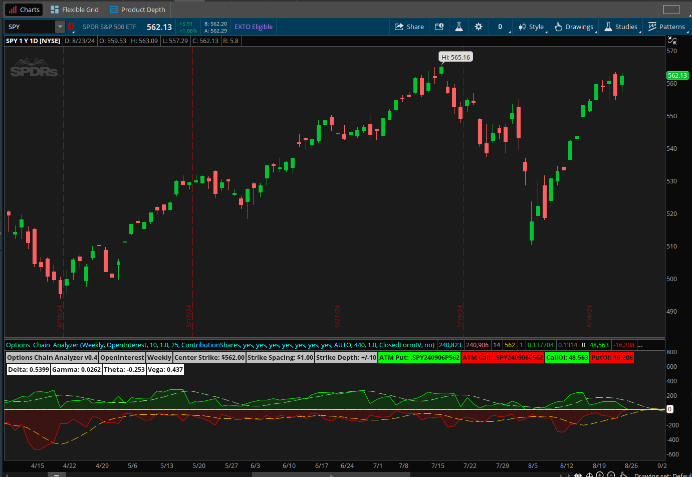
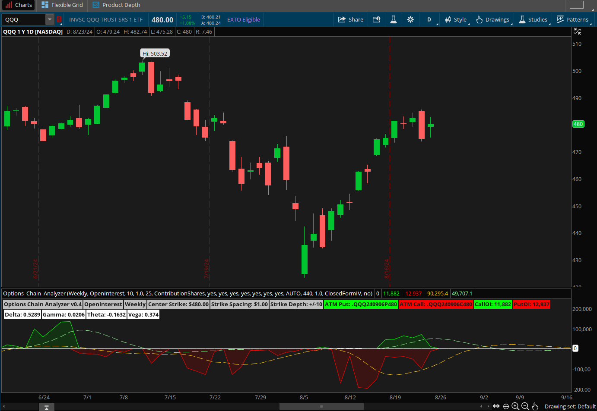

# Options Chain Analyser

A thinkscript study that will scan the options chain and display information about volume, open interest, and gamma exposure.
For use with the ThinkOrSwim platform.
Please note that this indicator only works on a **daily timeframe**. It will be **hidden automatically on intraday charts**.
Direct link - [http://tos.mx/!vXbU32rz](http://tos.mx/!vXbU32rz)
The conditions are configurable for a certain *strike depth* and *series*.
The *strike depth* is how far ITM, and OTM the study will scan starting with ATM options.
The *series* determines what option expiries to look for.

For example: With a strike depth of 5, and the series set to weekly, the study will scan all options for that day that are expiring on the next upcoming friday, starting ATM and going ITM 5 strikes, and OTM 5 strikes.

**⚠️ Warning: Setting the strike depth to large values requires significant processing power, and will result in slow loading times.**

Note: This is a custom study I wrote in thinkscript. It does not use any part of the options scanner that is built into the ThinkOrSwim platform or the condition wizard.

The results of this scan are configurable as well, by setting the 'data type'. Available data types are as follows:

- OpenInterest - Shows the total call and put open interest
- Volume - Shows the total call and put volume
- GammaExposure - Shows the total gamma exposure

For the GammaExposure data type, there are three settings as of now based on various formulas I have found.
You can select which method to use with the input 'gex calculation method'.
Available methods are as follows:

- ContributionShares: (<https://squeezemetrics.com/monitor/download/pdf/white_paper.pdf>)
  - Call GEX = gamma _OI_ 100
  - Put GEX = gamma _OI_ 100 \* -1
- Contribution: (<https://perfiliev.co.uk/market-commentary/how-to-calculate-gamma-exposure-and-zero-gamma-level/>)
  - Call GEX = gamma _OI_ 100 \* Spot Price
  - Put GEX = gamma _OI_ 100 _Spot Price_ -1
- ContributionPercent: (<https://perfiliev.co.uk/market-commentary/how-to-calculate-gamma-exposure-and-zero-gamma-level/>)
  - Call GEX = gamma _OI_ 100 _Spot Price ^2_ 0.01
  - Put GEX = gamma _OI_ 100 _Spot Price ^2_ 0.01 \* -1

The spot gamma at each contract is calculated using the Black Scholes Model. (shoutout to mobius for that one) (<https://www.investopedia.com/terms/b/blackscholes.asp>)

The spot price is calculated using the OptionPrice() function.

The Implied Volatility is sourced using the SeriesVolatility() function.

## Notes 🗒️

The goal is to have the script automagically select the nearest ATM strike price, and spacing (where the spacing is the dollar amount between adjacent contracts). This may not always work. To override this behavior, set the mode to MANUAL, and the script will use the inputs 'manual center strike' and 'manual strike spacing' for the selection.

All credits are posted in the study code at the top. Thanks!

## Disclaimer

This is a work in progress and as such I cannot guarantee that this data is correct, use at your own discretion.
